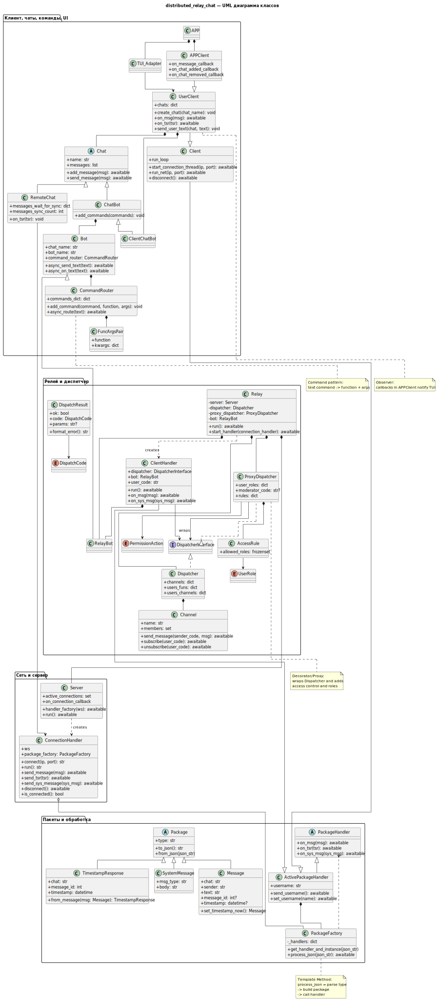

## Распределённый релей чат
Проект по дисциплине "Основы ИТ технологий".


## Установка и запуск

1. Клонируйте репозиторий и перейдите в папку проекта:
   ```bash
   git clone https://github.com/Hekysei/distributed_relay_chat.git
   cd distributed_relay_chat
   ```

2. Установите зависимости:
   ```bash
   python3 -m venv venv
   source venv/bin/activate   # или venv\Scripts\activate для Windows
   pip install -r requirements.txt
   ```
   **Если вы используете Windows, убедитесь, что пакет windows-curses был установлен (он добавлен в requirements.txt).**

3. Запустите сервер (релей):
   ```bash
   python3 relay.py
   ```

4. В новом терминале запустите TUI-клиент:
   ```bash
   python3 tui_client.py
   ```

## TODO
- Адекватно решить проблему curses и двух потоков


### UML
Подробности и паттерны — в [uml-task/README.md](uml-task/README.md).



- [PDF](uml-task/class-diagram.pdf)
- [PlantUML](uml-task/class-diagram.puml)

