## Распределённый чат
Проект по дисциплине "Основы ИТ технологий".

**Для запуска на виндоус требуются дополнительные зависимости из win_requirements.txt**

### Состояние:
- Прототип cli.

## TODO
- Адекватно решить проблему curses и двух потоков

### UML

```mermaid
classDiagram
direction TB

%% ==================== package ====================
namespace src.package {
  class Package {
    <<abstract>>
    +str type
    +to_json() str
    +from_json(json_str) Package$
  }

  class Message {
    +str chat
    +str sender
    +str text
    +int|None message_id
    +datetime|None timestamp
    +str type = "message_request"
    +set_timestamp_now() Message
  }

  class TimestampResponse {
    +str chat
    +int message_id
    +datetime timestamp
    +str type = "timestamp_response"
    +from_message(msg: Message) TimestampResponse$
  }

  class SystemMessage {
    +str msg_type
    +str body
    +str type = "system_message"
  }

  class PackageFactory {
    <<abstract>>
    #dict~str, Type~Package~~ _classes$
    #dict~str, Callable~ _handlers
    +get_handler_and_instance(json_str) tuple
    +process_json(json_str) void
    +async_process_json(json_str) awaitable
  }
}

Package <|-- Message
Package <|-- TimestampResponse
Package <|-- SystemMessage

PackageFactory ..> Package : creates via from_json()
PackageFactory ..> Message
PackageFactory ..> TimestampResponse
PackageFactory ..> SystemMessage

%% ==================== relay ====================
namespace src.relay {
  class Relay {
    -Server server
    -Dispatcher dispatcher
    +run() awaitable
    +start_handler(connection_handler: ConnectionHandler) awaitable
  }

  class Server {
    -set~ServerConnection~ active_connections
    +Callable~ConnectionHandler~ on_connection_callback
    +handler_factory(ws: ServerConnection) awaitable
    +run() awaitable
    +close_active_connections() awaitable
  }

  class ConnectionHandler {
    -ServerConnection ws
    -PackageFactory package_factory
    +run() awaitable
    +send_message(msg: Message) awaitable
    +send_tsr(tsr: TimestampResponse) awaitable
    +send_sys_message(sys_msg: SystemMessage) awaitable
  }

  class Channel {
    -dict~str, Callable~Message~~ members_funcs
    +send_message(msg: Message, sender_func: Callable|None) awaitable
    +subscribe(username: str, send_func: Callable~Message~) void
    +unsubscribe(username: str) void
  }

  class Dispatcher {
    -dict~str, Channel~ chanels
    -dict~str, Callable~Message~~ users
    +send_message(msg: Message, sender_func: Callable~Message~) awaitable
    +subscribe(channel_name: str, username: str, send_func: Callable~Message~) awaitable
    +unsubscribe(channel_name: str, username: str) awaitable
    +create_channel(channel_name: str, username: str, send_func: Callable~Message~) awaitable
    +call(msg: Message) awaitable
  }

  class RelayPackageFactory {
    -dict~str, Callable~ _handlers
    +__init__(connection_handler: ClientHandler)
  }

  class ClientHandler {
    +str username = "empty"
    -Dispatcher dispatcher
    -ConnectionHandler connection_handler
    -RelayBot bot
    +run() awaitable
    +on_start() awaitable
    +on_msg(msg: Message) awaitable
    +on_sys_msg(sys_msg: SystemMessage) awaitable
    +send_text_to_client(text: str) awaitable
    +set_username(name: str) awaitable
  }

  class RelayBot {
    +str chat_name
    +str bot_name
    +__init__(client_handler: ClientHandler)
  }
}

Relay *-- Server
Relay *-- Dispatcher
Server ..> ConnectionHandler : creates per connection
ConnectionHandler o-- PackageFactory : uses for parsing inbound
ClientHandler *-- RelayBot
ClientHandler o-- Dispatcher : uses
ClientHandler o-- ConnectionHandler : wraps
Dispatcher *-- Channel

RelayPackageFactory --|> PackageFactory
RelayPackageFactory ..> ClientHandler : routes inbound packages to handler methods
%% RelayPackageFactory maps package "type" -> ClientHandler.on_msg/on_sys_msg

ClientHandler ..> Message
ClientHandler ..> TimestampResponse
ClientHandler ..> SystemMessage

%% ==================== client ====================
namespace src.client {
  class NetClient {
    -WebSocket ws
    -PackageFactory package_factory
    +connect(ip: str, port: str) bool
    +run() Message
    +send_message(msg: Message) void
    +send_sys_message(sys_msg: SystemMessage) void
    +disconnect() void
  }

  class Client {
    +str username = "blank_name"
    +dict~str, Chat~ chats
    +Callable on_message_callback
    +Callable on_chat_added_callback
    +Callable on_chat_removed_callback
    -NetClient net_client
    -Thread|None connection_thread
    +connect_to_relay(ip: str, port: str) bool
    +run_net_client() void
    +start_connection_thread(ip: str, port: str) bool
    +disconnect() void
    +add_chat(chat: Chat) void
    +create_chat(chat_name: str) void
    +remove_chat(chat_name: str) void
    +on_msg(msg: Message) void
    +on_ts_response(tsr: TimestampResponse) void
    +on_sys_msg(sys_msg: SystemMessage) void
    +send_user_text(chat: str, text: str) void
    +set_username(name: str) void
    +send_username() void
  }
}

Client *-- NetClient
NetClient o-- PackageFactory : uses for parsing inbound
Client ..> Message
Client ..> TimestampResponse
Client ..> SystemMessage

%% ==================== chat & bot core ====================
namespace src {
  class Chat {
    <<abstract>>
    +str name
    +list~Message~ messages
    +add_message(msg: Message) void
    +send_message(msg: Message) void
  }

  class RemoteChat {
    -NetClient net_client
    -dict~int, Message~ messages_wait_for_sync
    -int messages_sync_count
    +send_message(msg: Message) void
    +on_tsr(tsr: TimestampResponse) void
  }

  class ChatBot {
    -Bot bot
    +add_commands(commands: list) void
    +send_message(msg: Message) void
  }

  class Bot {
    +str chat_name
    +str bot_name
    -CommandRouter command_router
    -Callable~Message~ send_message
    +add_command(command: str, function: Callable, args: dict) void
    +add_commands(commands: list) void
    +send_text(text: str) void
    +async_send_text(text: str) awaitable
    +on_text(text: str) void
    +async_on_text(text: str) awaitable
  }

  class FuncArgsPair {
    <<dataclass>>
    +Callable function
    +dict~str,str~ kwargs
  }

  class CommandRouter {
    -dict~str, FuncArgsPair~ commands_dict
    +add_command(command: str, function: Callable, args: dict) void
    +route(text: str) bool
    +async_route(text: str) awaitable~bool~
    +get_func_kwargs(text: str) tuple|None
    +parse_args(words: list, args: dict) dict|None
  }
}

Chat <|-- RemoteChat
Chat <|-- ChatBot
ChatBot *-- Bot
Bot *-- CommandRouter
CommandRouter *-- FuncArgsPair

RemoteChat o-- src.client.NetClient
Client o-- Chat : manages
%% Client stores Chat instances in dict[str, Chat], including RemoteChat and ChatBot

RelayBot --|> Bot

%% ==================== app (TUI) ====================
namespace src.app {
  class APPClientChatBot {
    +__init__(client: Client)
  }

  class APPClientPackageFactory {
    -dict~str, Callable~ _handlers
    +__init__(client: Client)
  }

  class APPClient {
    -APPClientChatBot chat_bot
    +__init__() void
    +send_user_text(chat: str, text: str) void
    +start_connection_thread(ip: str, port: str) bool
    +connect_to_relay(ip: str, port: str) bool
    +run_net_client() void
  }

  class TUI_Adapter {
    -curses.window stdscr
    -Client client
    -str input_buffer
    -str active_chat
    -int active_chat_idx
    -curses.window msg_win
    -curses.window inp_win
    -curses.window bar_win
    -bool is_stoped
    +run() void
    +iter() void
    +backspace() void
    +enter() void
    +step_chat(step: int = 1) void
    +handle_chat_removed() void
    +fresah_draw() void
    +create_window(h, w, y, x) curses.window
    +resize_windows() void
    +update_messages() void
    +update_input() void
    +update_bar() void
  }
}

APPClientChatBot --|> ChatBot
APPClientPackageFactory --|> PackageFactory
APPClient --|> src.client.Client
APPClient *-- APPClientChatBot
APPClientPackageFactory ..> APPClient : routes inbound packages to Client handlers

TUI_Adapter o-- src.client.Client : uses

%% ==================== entrypoints ====================
namespace root {
  class APP {
    -APPClient client
    -TUI_Adapter tui_adapter
    +run() void
  }

  class RelayMain {
    -Server server
    -Dispatcher dispatcher
    +run() awaitable
  }
}

APP *-- src.app.APPClient
APP *-- src.app.TUI_Adapter

RelayMain ..> src.relay.Relay : same role as class Relay in relay.py
%% relay.py defines Relay; main.py defines APP. RelayMain is a conceptual entrypoint wrapper for documentation.

```

