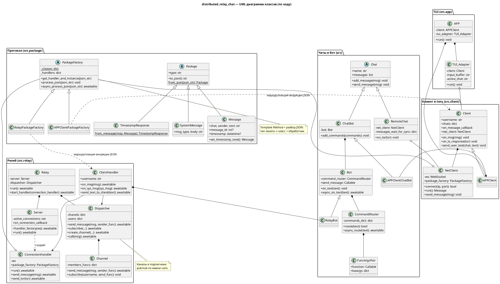

ЧК1

## Распределённый чат
Проект по дисциплине "Основы ИТ технологий".

**Для запуска на виндоус требуются дополнительные зависимости из win_requirements.txt**

## TODO
- Адекватно решить проблему curses и двух потоков

### UML

Диаграмма соответствует текущей структуре кода (пакеты протокола, релей, клиент, чаты/бот, TUI). Подробности и паттерны — в [uml-task/README.md](uml-task/README.md).

- [PDF](uml-task/class-diagram.pdf)
- [PlantUML](uml-task/class-diagram.puml)

