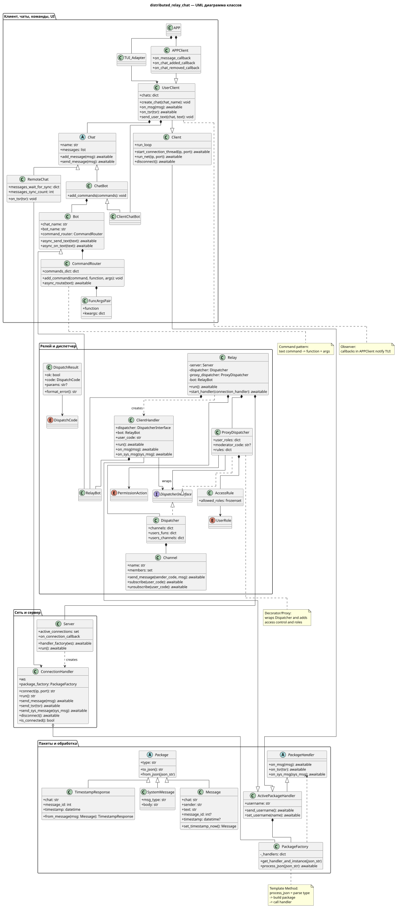

## Распределённый релей чат
Проект по дисциплине "Основы ИТ технологий".


## Клиент

### Готовый бинарный файл из релиза

Скомпилированные клиенты выкладываются в [релизах](https://github.com/Hekysei/distributed_relay_chat/releases).

### Запуск через Python

Из корня клона репозитория, с установленными зависимостями (`python3 -m venv venv`, активация venv, `pip install -r requirements.txt`):

```bash
python3 tui_client.py
```

На Windows: `python tui_client.py`. На Windows для `curses` нужен `windows-curses` из `requirements.txt`.

### Собрать свой клиент

Сборка даёт один исполняемый файл (или каталог) через [PyInstaller](https://pyinstaller.org/). Собирайте **на той же ОС**, под которую нужен бинарник: PyInstaller не кросс-компилирует (например, Linux → Windows).

1. Клонируйте репозиторий и перейдите в каталог проекта:

   ```bash
   git clone https://github.com/Hekysei/distributed_relay_chat.git
   cd distributed_relay_chat
   ```

2. Создайте виртуальное окружение и установите зависимости клиента и инструменты сборки:

   ```bash
   python3 -m venv venv
   source venv/bin/activate   # Windows: venv\Scripts\activate
   pip install -r requirements.txt -r requirements-build.txt
   ```

3. Запустите сборку из корня репозитория:

   - **Linux / macOS:** `python3 scripts/build_tui.py` или `./scripts/build-tui.sh`
   - **Windows:** `python scripts\build_tui.py` или `scripts\build-tui.bat`

   Готовый одиночный файл: `dist/tui_client` (Linux/macOS) или `dist\tui_client.exe` (Windows).

4. Опционально — сборка **папкой** (`dist/tui_client/` с исполняемым внутри):

   ```bash
   python3 scripts/build_tui.py --onedir
   ```

## Релей

### Запуск через Python

Из корня клона репозитория, с установленными зависимостями (`python3 -m venv venv`, активация venv, `pip install -r requirements.txt`):

```bash
python3 relay.py
```

По умолчанию релей слушает `0.0.0.0:12021`. Другой адрес и порт: `python3 relay.py --host 127.0.0.1 --port 12022` (порт должен совпадать с тем, что указывают клиент и при необходимости `moderator.py`).

### Запустить Docker

Нужны [Docker](https://docs.docker.com/engine/install/) и Compose.

Из **корня клона** репозитория:

```bash
docker compose up --build
```

Поднимутся сервисы **relay** (WebSocket, наружу обычно порт **12021**) и **moderator** (подключается к `relay` по внутреннему имени сервиса). Клиенты на вашей машине подключаются к `ws://localhost:12021`.

Фон, логи, остановка:

```bash
docker compose up -d --build
docker compose logs -f relay moderator
docker compose down
```

Если порт 12021 занят, измените проброс в `docker-compose.yml` (например `"12022:12021"`) и подключайте клиентов к внешнему порту **12022**.

## TODO
- Адекватно решить проблему curses и двух потоков


### UML
Подробности и паттерны — в [uml-task/README.md](uml-task/README.md).



- [PDF](uml-task/class-diagram.pdf)
- [PlantUML](uml-task/class-diagram.puml)
